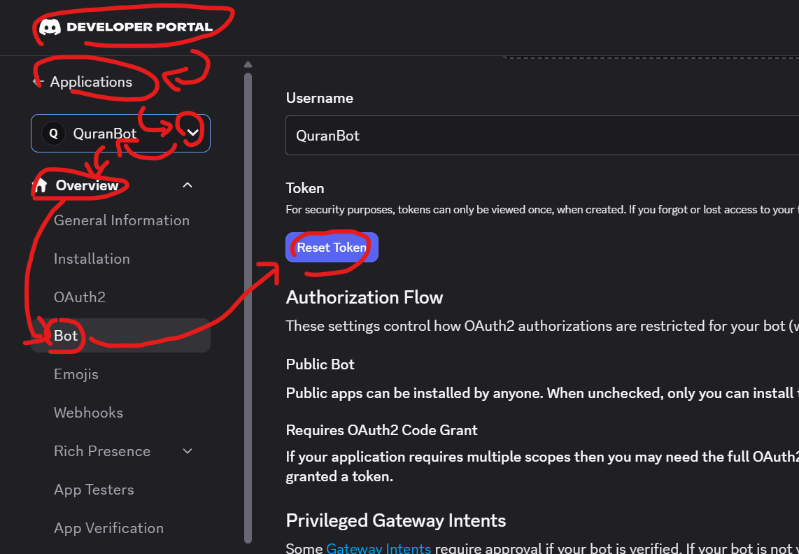

# ﴾ QuranBot ﴿
---
## ⏾ Overview
بسم الله الرحمن الرحيم

This is an open-source discord.py-based discord bot I made for displaying Islamic scripture. <br />
So that it is easy to access Islamic information while using Discord. <br />
It's written in Python and supports Docker. <br />
And the ease of use? So easy to set up that you might forget that you ever set it up! <br />

Amongst the reasons why I made this are:

It was narrated by Uthman that The Prophet(ﷺ) said:
>"The best among you are those who learn the Qur'an and teach it."
(Sahih al-Bukhari 5027)

It was narrated by Abu Huraira that The Prophet(ﷺ) said:
>"When a man dies, his acts come to an end, but three, recurring charity, or knowledge (by which people) benefit, or a pious child, who prays for him (for the deceased)."
(Sahih Muslim 1631)

Abu Huraira reported Allah's Messenger (ﷺ) as saying:
>"He who called (people) to righteousness, there would be reward (assured) for him like the rewards of those who adhered to it, without their rewards being diminished in any respect. And he who called (people) to error, he shall have to carry (the burden) of its sin, like those who committed it, without their sins being diminished in any respect."
(Sahih Muslim 2674)
---
## ⏾ Highlights
### Features and things to implement

||||
| ------------ | ------------ | ------------ |
| ✓ - Working/Added/Supported | / - Incomplete  | x - Unsupported/Not Added  |

|||
| ------------ | ------------ |
| Dockerized the application. | ✓  |
| A basic command to display Qur'ânic verses. | ✓  |
| Migrated to uv package manager. | ✓  |
| Chat commands for displaying Qur'ânic verses. | ✓  |
| Qur'ân SQLite database. | /  |
| A way to test the application using pytest. | /  |
| CONTRIBUTORS.md | x  |
| Daily verses on a specific channel. | x  |
| A command to display Ahadith. | x  |
| A command to display Tafsîr. | x  |
---
## ⏾ Features
- `/help`: A slash command that displays all the available slash commands.
- `/quran`: A slash command that takes two arguments of integer type as input, chapter and verse, it displays a Qur'ânic verse based on the given user input. (Example: `/quran chapter:2 verse:4` will display the contents of Surah Al-Baqarah, ayah number four.)
---
## ⏾ Requirements
To start hosting your own QuranBot, you will need:
- [Docker](https://www.docker.com/get-started/)
- [Python (Preferably version 3.11 or 3.12)](https://www.python.org/downloads/)
>Note: You won't really need Python if you're going to use Docker.

And that's pretty much it.
---
## ⏾ Installation
### Short Instructions
- Create your bot
- Get the auth token
- Make and fill out your .env file
- Run `docker compose up`

That's it.
### Detailed Instructions:
Before we begin, download the source code and extract it to a folder, you can name it something like "quranbot". <br />
First things first, you need to create a new Discord application. <br />
Head to the [Discord Developer Portal](https://discord.com/developers/applications) and create your bot application. <br />
After you have done that, you will need to get its Authorization Token <br />
Head to Applications -> Your Application -> Overview -> Bot <br />

Click the "Reset Token" button, it will show you the bot's token, copy the token to your clipboard. <br />
Create an ".env" file, the structure of the .env file should be the way it's instructed in .env.example, <br />
fill out the .env file accordingly to what you have, whether it be bot tokens, PostgreSQL usernames, passwords, etc. <br />
After that, open up your terminal, go to the root directory of the project, and run the following: <br />

```bash
docker compose up
```
This will build the application, create a database and run the container. <br />

To safely shut it down, run the following:
```bash
docker compose down
```

If you want to shut down the application and delete its saved data, run:
```bash
docker compose down -v
```
>Note: Please use this command responsibly, this will power down the container AND delete the saved PostgreSQL data.

If you've done everything completely, you should see the bot's status as online while the container is running.
---
## ⏾ Feedback & Collaboration:
Feel free to make discussions in [here](https://github.com/AzuritilDev/QuranBot/discussions) and report any bugs, vulnerabilities, mistakes etc. in the [issues](https://github.com/AzuritilDev/QuranBot/issues) section of the repository. <br />


---
## ⏾ Authors:
[@AzuritilDev](https://github.com/AzuritilDev)


Made with passion & good intentions, <br />
gifted to the Ummah ❤️