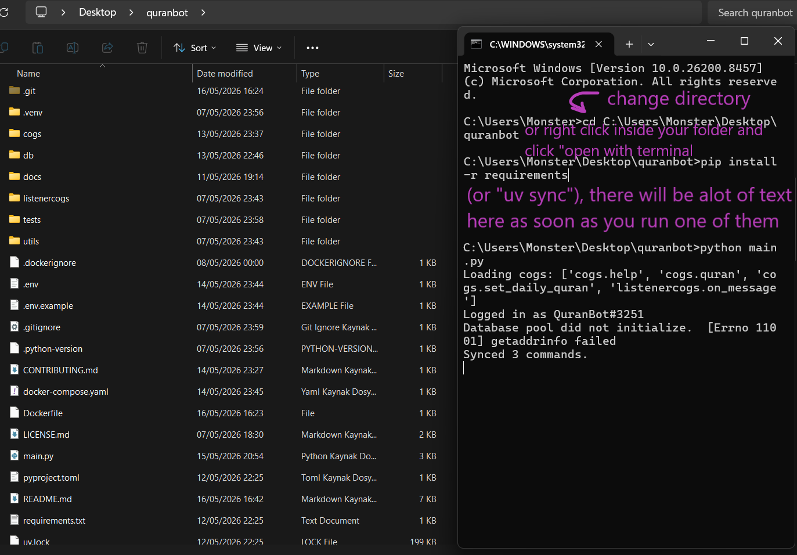

# ﴾ QuranBot ﴿

<p align="center">
  
</p>

## Dökümantasyon Hakkında Uyarı:
Bu çeviri orijinal İngilizce olan dökümantasyon ile ([README.md](README.md)) güncel olmayabilir, <br />
o yüzden sadece orijinal İngilizce dökümantasyonu kesin doğru bilgi kaynağı olarak kabul ediniz. <br />
**NOT:** QuranBot'un dökümantasyonunun spesifik olarak Türkçe çevirisi proje sorumlusu [@AzuritilDev](https://github.com/AzuritilDev) tarafından çevriliyordur. 

## Yasal ve Dini Uyarılar

### 1. Dini Uyarı
Bu uygulamada sunulan Kur'an-ı Kerim mealleri Saheeh International çevirisinden alınmıştır. Bu çeviri dünya çapında güvenilir ve saygın kabul edilse de, hiçbir meal orijinal Arapça metnin derinliğini, nüanslarını ve tam anlamını eksiksiz bir şekilde yansıtamaz. Bu yorumlar tamamen mütercimlerin ilmi çalışmalarının bir sonucudur. Kesin hükümler veya detaylı araştırmalar için kullanıcıların yetkin İslam alimlerine danışmaları tavsiye edilir.

### 2. Hesaplama Uyarısı
Namaz vakitleri, [Adhanpy](https://github.com/alphahm/adhanpy/) (Adhan) kütüphanesi kullanılarak otomatik olarak hesaplanmaktadır. Bu hesaplamalar, yüksek hassasiyetli astronomik denklemlere ve küresel standart hesaplama yöntemlerine (örneğin ISNA, MWL) dayanmaktadır. Küçük coğrafi ve atmosferik farklılıklar nedeniyle bu namaz vakitleri birer tahmindir. Kullanıcıların vakitleri gözle veya en yakın camiden okunan yerel ezanı dinleyerek doğrulamaları önerilir.

### 3. Sorumluluk Sınırlandırması
Bu uygulamanın geliştiricileri ve katkıda bulunanları; burada sunulan bilgilerin, namaz vakitlerinin veya meallerin kullanımından, yorumlanmasından veya bunlara güvenilmesinden kaynaklanabilecek doğrudan, dolaylı veya arızi hiçbir zarardan veya kâr kaybından sorumlu tutulamaz.

### 4. Açık Kaynak ve Telif Hakkı Bildirimi
Bu uygulama, açık kaynaklı yazılımlar ve telif hakkı korumalı materyaller kullanmaktadır:
* **Adhanpy / Adhan Kütüphanesi:** MIT Lisansı altında dağıtılan, alphahm tarafından geliştirilen ve Batoul Apps Adhan ekosistemini temel alan açık kaynaklı adhanpy kütüphanesinden güç almaktadır.
* **Saheeh International Kur'an Meali:** Kur'an-ı Kerim anlamlarının dijital olarak görüntülenmesi ve dağıtılmasına ilişkin standart izinlere uygun olarak kullanılmaktadır.

## ⏾ Genel Görünüm
<br /> بسم الله الرحمن الرحيم


Bu benim kutsal İslami metinleri göstermek amaçlı yaptığım discord.py tabanlı, açık kaynak bir Discord botudur. <br />
Bu sayede Discord kullanırken kutsal İslami metinlere ulaşım daha kolay olur. <br />
Python dilinde yazılmıştır ve Docker'ı destekler. <br />
Ve kullanım kolaylığı mı? Kurması o kadar kolay ki, kurduğunuzu bile unutabilirsiniz! <br />

Bu projeyi yapmamın sebepleri arasında bunlar var:

Osman (r.a) tarafından rivayet edildiğine göre, Hz. Peygamber (ﷺ) şöyle dedi:
>"Aranızda en iyi olanlar Kur'ân'ı öğrenenler ve öğretenlerdir."
(Sâhîh-i Buhâri 5027, kitap-içi referans: 66. Kitap, 49. Hadis)

Ebû Hüreyre (r.a) tarafından rivayet edildiğine göre, Hz. Peygamber (ﷺ) şöyle dedi:
>"Bir adam vefat ettiğinde, onun amelleri, şu üçü hariç, sona erir: Tekrarlayan sadaka, veya (insanların) faydalandığı ilim, ya da onun için dua eden dindar bir çocuk."
(Sâhîh-i Müslim 1631, kitap-içi referans: 25. Kitap, 20. Hadis)

Ebû Hüreyre (r.a) tarafından rivayet edildiğine göre, Allah'ın Resûlü (ﷺ) dedi ki:
>"İnsanları doğru yola çağıranın, doğru yolda kalanlarınki gibi bir mükafatı vardır; onların mükafatları hiçbir şekilde eksiltilmez. İnsanları sapıklığa çağıranın ise, sapıklığı işleyenlerin günahları gibi onun günahının yükünü taşıması gerekir; onların günahları hiçbir şekilde eksiltilmez."
(Sâhîh-i Müslim 2674, kitap-içi referans: 47. Kitap, 30. Hadis)

>Not: Bu hadisler Sunnah.com'daki İngilizce çeviriden Türkçe'ye çevrilmiştir, çeviride hata olabilir.

---

## ⏾ Öne Çıkan Noktalar
### Özellikler ve uygulanması gereken şeyler:

||||
| ------------ | ------------ | ------------ |
| ✓ - Çalışıyor/Eklendi/Destekleniyor | / - Henüz Tamamlanmadı  | x - Desteklenmiyor/Eklenmedi  |

|||
| ------------ | ------------ |
| Kur'ân-ı Kerim ayetlerini gösteren bir komut. | ✓  |
| Uygulama Docker-ize edildi. | ✓  |
| Uv Paket Yöneticisi'ne taşınıldı. | ✓  |
| Muhabbet yerinde kullanılabilen, Kur'ânı Kerim ayetlerini gösteren komutlar. | ✓  |
| Namaz vakitlerini gösteren bir komut. | ✓  |
| Belirli bir kanalda günlük Kur'ân-ı Kerim ayetleri gösterebilme özelliği. | /  |
| Uygulamayı pytest ile test edebilme yolu. | /  |
| Kur'ân-ı Kerim SQLite veritabanı. | x  |
| Botun özel sözü periyodik bir şekilde listeden seçilen rastgele bir söze değişebilmesi. | x  |
| Hadis-i Şerif rivayetleri gösteren bir komut | x  |
| Tefsir gösteren bir komut. | x  |

---

## ⏾ Özellikler
- `/help`: Diğer eğik çizgi komutlarının listesini gösteren bir komut.
- `/quran`: İki tamsayı tipi argümanını giriş olarak kabul eder, sûre ve ayet, kullanıcının girdiği değerlere göre bir Kur'ân-ı Kerim ayeti gösterir. (Örnek: `/quran chapter:2 verse:4` Bakara Sûresi, 4. ayetin içeriğini gösterecektir.)
- `/set-daily-quran`: Seçilen muhabbet kanalında bir webhook oluşturur ve o kanala günlük ayetler gönderir. (Kullanış Örneği: `/set-daily-quran channel:#genel`)
- `/prayer-times`: Seçilen şehrin coğrafik konumuna göre günün içindeki farz olan namazların vakitlerini gösterir. (Kullanış Örneği: `/prayer-times city:Istanbul`)
- `/status`: Bot hakkında sistem bilgileri gösterir. 

---
## ⏾ Gereksinimler
Kendi QuranBot uygulamanızı çalıştırmak için şunlara ihtiyaç duyacaksınız:
- [Docker](https://www.docker.com/get-started/)
- [Python (Preferably version 3.11)](https://www.python.org/downloads/)
>Not: Docker kullanacaksanız Python'a çokta ihtiyaç duymayacaksınız.

Gereksinimler bu kadar.

---

## ⏾ Kurulum

Kurmadan Önce: Repo'yu "<> Kod" kısmı üzerinden bir .zip dosyası olarak ya da terminalinizde `git clone https://github.com/AzuritilDev/QuranBot` kodu üzerinden klonladığınızdan emin olun.

## 1. Docker Kullanarak Kurulum:
### Kısa Talimatlar
- Botunuzu Discord Developer Portalı'ndan oluşturun
- Yetkilendirme belirtecini (yani auth tokenini) kopyalayın
- .env dosyanızı oluşturup .env.example'da anlatıldığına göre doldurun
- Bu terminal komutunu çalıştırın: `docker compose up`

Bu kadar.
### Detaylı Talimatlar:
Başlamadan önce, projenin kaynak kodunu yükleyin ve bir klasöre ayrıştırın, bu klasöre "kuranbot" gibi bir ad verebilirsiniz. <br />
İlk öncelikle yeni bir Discord uygulaması oluşturmanız lazım. <br />
[Discord Developer Portal](https://discord.com/developers/applications)'ına girin ve bot uygulamanızı oluşturun. <br />
Oluşturduktan sonra, botun Yetkilendirme Belirteci'ne (yani Authorization Token'ine) ihtiyaç duyucaksınız. <br />
Şuraya gidin: Uygulamalar -> Uygulaman -> Genel Bakış -> Bot <br />

"Sıfırla" tuşuna basın, size botun belirtecini gösterecektir, onu kopyalayın. <br />
Klasörde bir ".env" dosyası oluşturun, bu dosyanın yapısı ".env.example"in yapısı ile uyuşmalı, ordaki talimatlara uyun, <br />
.env dosyasını sahip olduklarınıza göre doldurun, bu bir belirteç olabilir, PostgreSQL kullanıcı adı, şifresi olabilir vesaire vesaire. <br />
ya da .env.example.clean'deki değişkenlerin değerlerini istediğinize göre değiştirin sonra da dosyanın ismini ".env" yapın <br /> 
Sonra, terminalinizi açın, projenin kök klasörüne gidin, ve şu komutu çalıştırın: <br />

```bash
docker compose up
```
Bu uygulamayı kuracak, veritabanı oluştaracak be konteyneri çalıştaracaktır. <br />

Güvenli bir şekilde kapatmak için, şunu calıştırın:
```bash
docker compose down
```

Eğer uygulamayı hem kapatıp hem de kaydedilmiş veritaban verilerini silmek istiyorsanız, şunu çalıştırın: 
```bash
docker compose down -v
```
>Note: Lütfen bu komutu sorumluluk alarak çalıştırın, bu konteynerin gücünü kesecek VE hem de kaydedilmiş PostgreSQL verilerini silecektir.

Eğer herşeyi doğru yaptıysanız, botun durumunu çevrim içi olarak ve konteynırı çalışıyor olarak görüceksiniz. <br />

Özel yapınızın kaynak kodunu güncellediyseniz aşağıdakileri kullanarak çalıştırdığınızdan emin olun:
``` bash
docker compose up --build
```
Değişikliklerinizle güncel tutmak için. <br />

Konteyneri, loglar terminalinizi doldurmadan arka plan görevi olarak çalıştırmak istiyorsanız, bunu `-d` parametresi ile çalıştırın:
``` bash
docker compose up -d
```
## 2. Manuel Python Kurulumu:
### Kısa Talimatlar:
- Projenin kaynak kodunu yükleyin ve bir klasöre ayrıştırın.
- .env dosyanızı oluşturun ve doldurun.
- Önemli gereksinimleri yüklemek için `uv sync --frozen --no-dev` ya da `pip install -r requirements.txt` komutunu çalıştırın
- Şu komut ile uygulamayı çalıştırın: `python main.py`

Bu kadar.
### Detaylı Talimatlar:
- Botun belirtecini alın, not defterinize ya da herhangi gizli bir yere yazın.
- [Python](https://www.python.org/downloads/) versiyon 3.11'i yükleyin.
- Projenin kaynak kodunu yükleyin, eğer bir .zip dosyası olarak indirdiyseniz bir klasöre ayrıştırın ve klasöre "kuranbot" gibi bir isim verin.
- Bir .env dosyası oluşturun, bu dosyayı .env.example'de anlatıldığına göre doldurun (Docker kullanmayacaksanız Docker ile ilgili değişkenleri silebilirsiniz).
- Terminalinizi açın, kuranbot klasörünüzün içinde açtığınızdan emin olun.
- Uv paket yöneticisini kullanıyorsanız `uv sync --frozen --no-dev` komutunu çalıştırın ama requirements.txt kullanmayı tercih ediyorsanız `pip install -r requirements.txt` komutunu çalıştırın, bunları yapmadan önce tabii ki cihazınızda pip paket yöneticisinin yüklü olduğundan emin olun (Uv paket yöneticisini yüklemek isterseniz, ya `pip install uv` komutunu çalıştırın ya da cihazınızda pip yüklü değil ise [burayı ziyaret edin](https://docs.astral.sh/uv/getting-started/installation/)).

- `python main.py` komutunu çalıştırın ve bot çalışacaktır, durdurmak istediğinizde terminal içinde Ctrl+C tuş kombinasyonuna basın.

---

## ⏾ Geri Bildirim & İşbirliği:
Lütfen [burada](https://github.com/AzuritilDev/QuranBot/discussions) tartışmalara katılın ve hataları, yanlışları vb. deponun [sorunlar](https://github.com/AzuritilDev/QuranBot/issues) bölümünde bildirin. <br />

Lütfen [katkıda bulunma](CONTRIBUTING.md) ve [davranış kuralları](CODE_OF_CONDUCT.md) ile ilgili depo kılavuzunu inceleyin.
## ⏾ Yazarlar:
[@AzuritilDev](https://github.com/AzuritilDev)


Tutku ve iyi niyetle yapıldı, <br />
Ümmete hediye edildi ❤️
## ⏾ Lisans:
[MIT](LICENSE.md) lisansı altında dağıtılıyor.